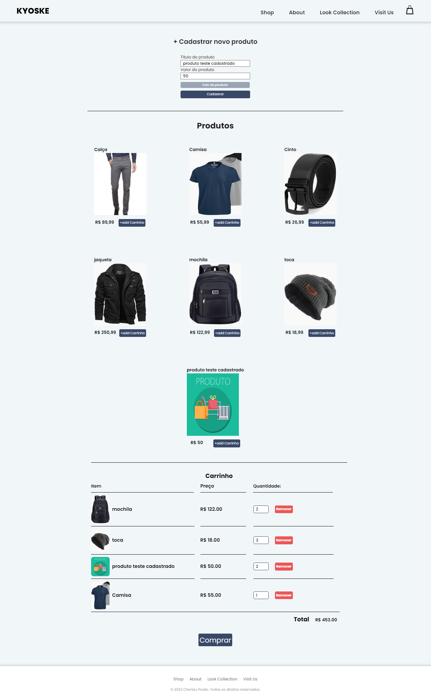

# KYOSKE página de ecommerce

## 💻 Sobre

Projeto de e-commerce intuitivo, onde é possível adicionar facilmente novos produtos ao catálogo e incluí-los no carrinho de compras. Cada produto é representado por um objeto que é adicionado à classe "carrinho". A funcionalidade de salvar os produtos selecionados no carrinho é implementada utilizando o LocalStorage, garantindo que você não perca seus itens durante a navegação.

- [x] Adicionar produtos ao catálogo
- [x] Incluir itens do catálogo ao carrinho
- [x] Escolher a quantidade do item no carrinho
- [x] Remover item do carrinho
- [x] items do carrinho salvos em LocalStorage
- [x] "Comprar" limpa o carrinho

<h3 align="center">
⚙️ Tecnologias utilizadas

&nbsp;

</h3>

---

## 🚧 Projeto

<h3 align="center"> Kyoske - ecommerce
  

  </a>	
</h3>

---

## ✒️ Autor

| [    Cherlau Prado ](https://github.com/cherPrado) |
| :--------------------------------------------------------------------------------------------------------------------------------------------: |

<h2 >Entre em contato 🤙🏽</h2>

